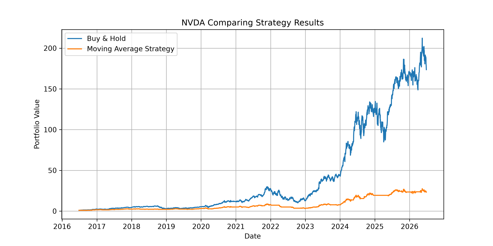
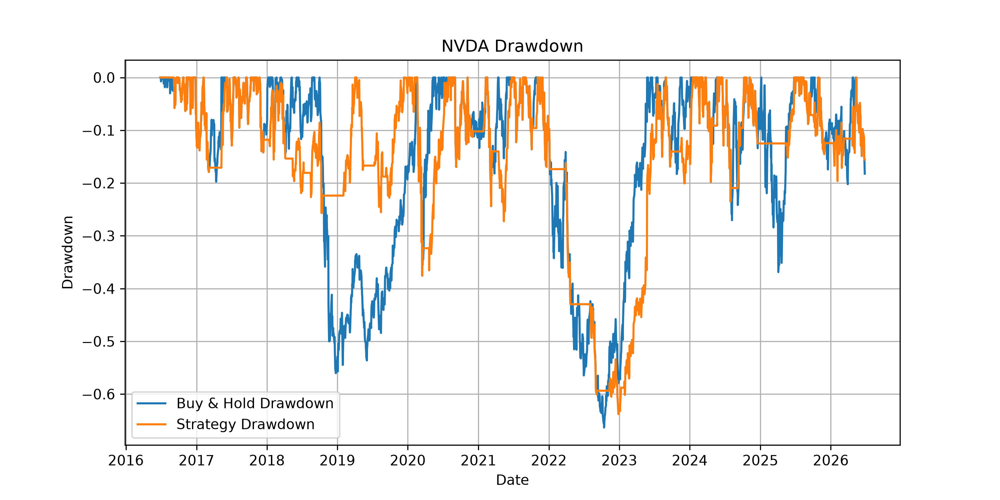

# Moving Average Trading Strategy and Backtest

## Overview

This project compares a simple moving average crossover strategy with a buy-and-hold investment over the last 10 years of stock data from Yahoo Finance.

The strategy uses:

- 20-day moving average
- 50-day moving average

When the 20-day average crosses above the 50-day average, the strategy buys (enters market).
When it falls below, the strategy moves to cash (withdraws from market)

---

## Features

- Downloads stock prices using yfinance
- Caches downloaded data
- Calculates

  - Total Return
  - Annualized Return
  - Volatility
  - Sharpe Ratio
  - Maximum Drawdown

- Compares Buy & Hold against the moving average strategy
- Produces performance charts

---

## Installation

```bash
pip install -r requirements.txt
```

---

## Running

```bash
python main.py
```

Enter stock tickers separated by commas, or press Enter to use the default list.

---

## Example Results

### NVDA Strategy Performance



### NVDA Drawdown



---

## Findings and Conclusion

The moving average strategy generally reduced drawdowns by exiting the market during prolonged declines. However, in strong bull markets it sometimes underperformed buy-and-hold because it missed portions of the recovery after moving to cash.

Performance varied significantly depending on the stock selected.